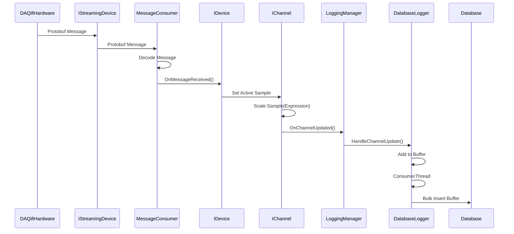

# DAQifi Desktop

Windows desktop application (.NET) that is used to communicate with DAQifi hardware.

## Tech Stack

- .NET 4.8
- WPF

## Dependencies

- EntityFramework (ORM) for SQL Server Compact
- Google Protocol Buffers (communication with DAQifi hardware)
- MahApps (UI components)
- Oxyplot (for graphing)

## CI/CD

Coming soon (Requires .NET6 to build with GitHub Actions)

## Documentation

## Installer

- Uses [Wix Toolset](https://wixtoolset.org/)
