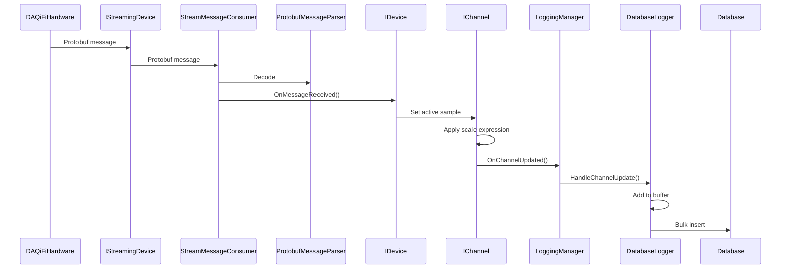

# DAQiFi Desktop

> "Revolutionizing the data collection experience with convenient, portable device connectivity."
>
> The official Windows desktop application for DAQiFi hardware — real-time visualization, session logging, and firmware updates, all in one place.

[daqifi.com](https://daqifi.com) · [daqifi-core SDK](https://github.com/daqifi/daqifi-core) · [Issues](https://github.com/daqifi/daqifi-desktop/issues) · [Discussions](https://github.com/daqifi/daqifi-desktop/discussions)

---

## What is DAQiFi Desktop?

DAQiFi hardware is designed to get out of the way so you can focus on the data, not the collection process. DAQiFi Desktop is the application that makes that possible — connect a Nyquist device over WiFi or USB, configure your channels, start a logging session, and watch your data arrive in real time. No custom scripting required.

If you are building automated pipelines or integrating DAQiFi devices into your own software, the [daqifi-core](https://github.com/daqifi/daqifi-core) .NET SDK gives you programmatic access to the same hardware.

## Quick install / first run

1. Download the latest `DAQifiDesktop_Setup.msi` from the [Releases page](https://github.com/daqifi/daqifi-desktop/releases).
2. Run the installer — no prerequisites beyond the included .NET runtime.
3. Launch **DAQiFi Desktop**.
4. Click **Connect** and let the app discover your Nyquist device on the local network, or enter its IP address manually.
5. Enable the channels you want to log and press **Start Logging**.

## Common applications

- **Space research** — sensor data acquisition for moon regolith testing
- **Medical R&D** — prosthetic socket pressure monitoring
- **Industrial monitoring** — continuous analog and digital I/O logging
- **Engineering education** — hands-on data acquisition with SCPI-compliant hardware

## Where DAQiFi Desktop fits

| Layer | Repo | What it does |
|---|---|---|
| Hardware | Nyquist 1 / Nyquist 3 | Wireless DAQ devices (WiFi + USB, battery-powered) |
| SDK | [daqifi-core](https://github.com/daqifi/daqifi-core) | .NET library for device communication and data streaming |
| **App** | **daqifi-desktop** | **GUI for device connection, visualization, logging, and firmware updates** |
| User code | Your project | Custom dashboards, test rigs, or automated pipelines built on daqifi-core |

## What you can do

| Capability | What it means for you |
|---|---|
| Auto-discovery over WiFi (UDP, port 30303) | Devices appear automatically when they are on the same network |
| Manual IP connection | Connect directly to a known device address when broadcast discovery is not available |
| USB / Serial connection | Use USB as an alternative to WiFi — same data, no network configuration needed |
| Multiple simultaneous devices | Connect and log from more than one Nyquist at the same time |
| Real-time channel visualization | Analog and digital channels plotted live with a viewport-aware minimap for large datasets |
| Start / stop logging sessions | Record data to a local SQLite database; sessions are preserved between runs |
| Per-channel formula scaling | Apply a custom NCalc expression (e.g. `x * 0.001 + 273.15`) to convert raw values before display and logging |
| CSV export with optional averaging | Export one or more sessions to `.csv`; optionally downsample by averaging N consecutive samples |
| Named profiles | Save and restore channel and device configurations across sessions |
| Firmware update via USB HID | Update Nyquist firmware from within the app — no separate tool needed |
| Error reporting via Sentry | Unhandled exceptions are captured automatically to help the team diagnose issues |

## Supported devices

| Device | Analog inputs | Resolution | Input range | Digital I/O | Transport | Power |
|---|---|---|---|---|---|---|
| Nyquist 1 | 16 | 12-bit | 0 – 5 V | Yes | 802.11n WiFi + USB | Battery |
| Nyquist 3 | 8 | 18-bit | ±10 V | Yes | 802.11n WiFi + USB | Battery |

Both devices are SCPI-compliant and compatible with LabVIEW.

## How data flows

```mermaid
sequenceDiagram
    DAQiFiHardware->>IStreamingDevice: Protobuf message
    IStreamingDevice->>StreamMessageConsumer: Protobuf message
    StreamMessageConsumer->>ProtobufMessageParser: Decode
    StreamMessageConsumer->>IDevice: OnMessageReceived()
    IDevice->>IChannel: Set active sample
    IChannel->>IChannel: Apply scale expression
    IChannel->>LoggingManager: OnChannelUpdated()
    LoggingManager->>DatabaseLogger: HandleChannelUpdate()
    DatabaseLogger->>DatabaseLogger: Add to buffer
    DatabaseLogger->>Database: Bulk insert
```

## WiFi connectivity

**Requirements:**

- Computer and DAQiFi device must be on the same subnet
- UDP port 30303 must be reachable (configured automatically when the app runs with administrator privileges)
- Virtual machines: use bridged networking, not NAT

**Troubleshooting:**

1. Run DAQiFi Desktop as administrator so it can configure the firewall rule automatically.
2. Confirm the computer and device are on the same WiFi network.
3. Test reachability with `ping <device-ip>`.
4. If discovery does not find the device, use **Manual Connection** and enter the IP address directly.

**Port reference:**

| Protocol | Port | Purpose |
|---|---|---|
| UDP | 30303 | Device discovery broadcasts |
| TCP | Device-specific (typically 9760) | Data streaming |

## Requirements

- **OS**: Windows 10 or later (x64)
- **Runtime**: .NET 10.0 for Windows (bundled in the MSI installer)
- **Privileges**: Administrator rights recommended for automatic firewall configuration during initial setup

## Community & support

- **Bug reports and feature requests**: [GitHub Issues](https://github.com/daqifi/daqifi-desktop/issues)
- **Questions and discussion**: [GitHub Discussions](https://github.com/daqifi/daqifi-desktop/discussions)
- **Commercial inquiries and custom hardware**: [daqifi.com](https://daqifi.com)

## Contributing

Please read the [Contributing Guidelines](CONTRIBUTING.md) before opening a pull request. All PRs require a conventional commit title (`feat:`, `fix:`, `docs:`, `deps:`, `chore:`) and at least one approving review from a DAQiFi core member.

## For maintainers

Releases are created by pushing a GitHub Release tag. The `release.yaml` workflow builds the MSI via WiX Toolset and attaches `DAQifiDesktop_Setup.msi` to the release automatically. The app version is set in `Daqifi.Desktop/Daqifi.Desktop.csproj` (`<Version>`). Follow [semantic versioning](https://semver.org/); breaking changes should use the `feat!:` prefix in the PR title.

---

Built by [DAQiFi](https://daqifi.com) · Licensed under [MIT](LICENSE)

