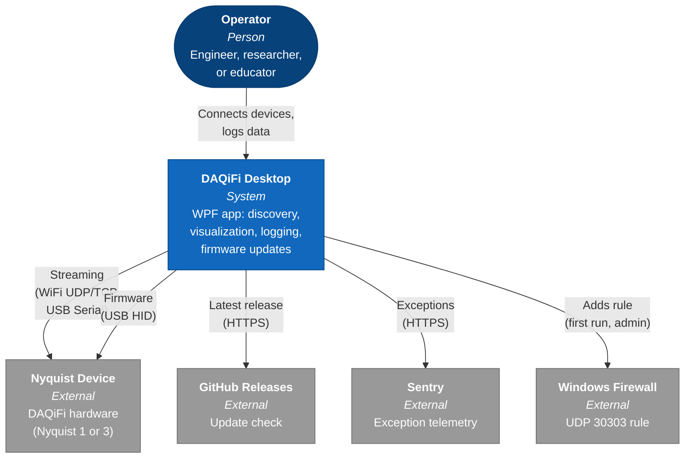
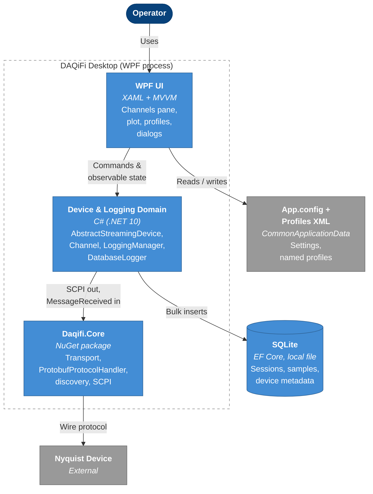
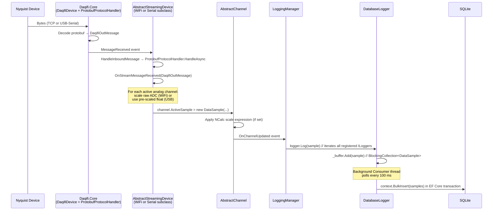

# Architecture

This document is for contributors. It explains how DAQiFi Desktop is structured and how a single sample makes its way from a Nyquist device into the SQLite database. For visual/interaction principles, see [design-philosophy.md](design-philosophy.md). For specific design decisions, see [adr/](adr/).

## System context

How DAQiFi Desktop relates to the world outside it.

## Containers

What lives inside the DAQiFi Desktop process and on the user's machine.

## Streaming data flow

One sample's journey from the device wire to the database. Every step below was verified against the current code; the layer that owns each step is in parentheses.

### Notes on the flow

- **WiFi vs USB scaling.** WiFi firmware sends raw ADC counts; USB firmware sends pre-scaled floats already in volts. `OnStreamMessageReceived` branches on this — see `AnalogInData` vs `AnalogInDataFloat` in [AbstractStreamingDevice.cs](../Daqifi.Desktop/Device/AbstractStreamingDevice.cs).
- **Two parallel paths per protobuf message.** The same `DaqifiOutMessage` produces per-channel `DataSample`s (the path above) *and* a single `DeviceMessage` carrying device-level state (battery, status, target frequency). The latter is dispatched via `LoggingManager.HandleDeviceMessage`.
- **Loggers are a list, not a single class.** `LoggingManager.Loggers` is an `ILogger` collection. `DatabaseLogger` is the persistent one, but `PlotLogger` and `SummaryLogger` also subscribe.
- **Backpressure.** `DatabaseLogger` uses a `BlockingCollection<DataSample>` producer/consumer split so the UI/device threads never wait on disk. The consumer drains in ~100 ms ticks and bulk-inserts via `EFCore.BulkExtensions.Sqlite`.
- **Timestamps.** `Daqifi.Core.TimestampProcessor` handles hardware-counter rollover and provides the firmware-measured inter-message delta (immune to TCP jitter).

## Key entry points

| Concern | Start here |
|---|---|
| New device transport | `Daqifi.Desktop/Device/AbstractStreamingDevice.cs` and the subclasses under `WiFiDevice/`, `SerialDevice/` |
| Channel behavior or scaling | `Daqifi.Desktop/Channel/AbstractChannel.cs` (`ActiveSample` setter) |
| Logging pipeline | `Daqifi.Desktop/Loggers/LoggingManager.cs` and `DatabaseLogger.cs` |
| Plot rendering and downsampling | See [adr/001-viewport-aware-downsampling.md](adr/001-viewport-aware-downsampling.md) |
| Visual and interaction design | See [design-philosophy.md](design-philosophy.md) |
