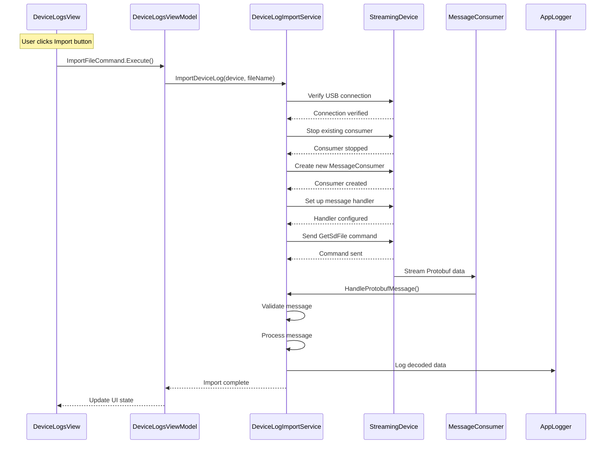

```mermaid
sequenceDiagram
    participant UI as DeviceLogsView
    participant VM as DeviceLogsViewModel
    participant Service as DeviceLogImportService
    participant Device as StreamingDevice
    participant Consumer as MessageConsumer
    participant Logger as AppLogger

    Note over UI: User clicks Import button
    UI->>VM: ImportFileCommand.Execute()
    VM->>Service: ImportDeviceLog(device, fileName)
    
    Service->>Device: Verify USB connection
    Device-->>Service: Connection verified
    
    Service->>Device: Stop existing consumer
    Device-->>Service: Consumer stopped
    
    Service->>Device: Create new MessageConsumer
    Device-->>Service: Consumer created
    
    Service->>Device: Set up message handler
    Device-->>Service: Handler configured
    
    Service->>Device: Send GetSdFile command
    Device-->>Service: Command sent
    
    Device->>Consumer: Stream Protobuf data
    Consumer->>Service: HandleProtobufMessage()
    
    Service->>Service: Validate message
    Service->>Service: Process message
    Service->>Logger: Log decoded data
    
    Service-->>VM: Import complete
    VM-->>UI: Update UI state
``` 