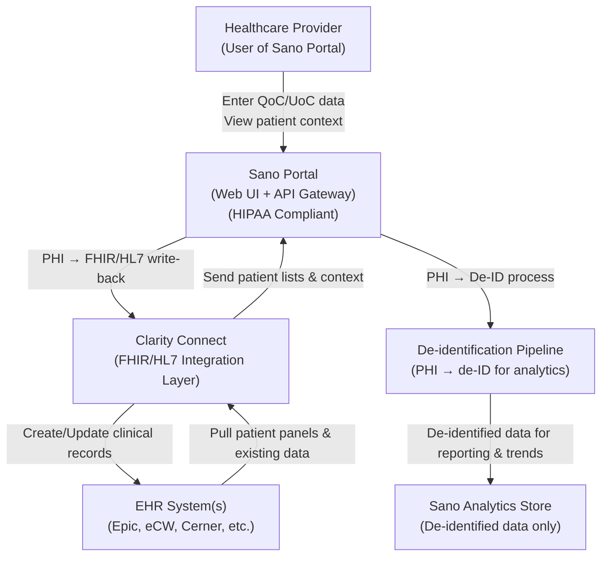

```mermaid
flowchart TB
    %% Nodes
    Provider["Healthcare Provider\n(User of Sano Portal)"]
    Portal["Sano Portal\n(Web UI + API Gateway)\n(HIPAA Compliant)"]
    Clarity["Clarity Connect\n(FHIR/HL7 Integration Layer)"]
    EHR["EHR System(s)\n(Epic, eCW, Cerner, etc.)"]
    DeID["De-identification Pipeline\n(PHI → de-ID for analytics)"]
    Analytics["Sano Analytics Store\n(De-identified data only)"]

    %% Connections
    Provider -->|"Enter QoC/UoC data\nView patient context"| Portal
    Portal -->|"PHI → FHIR/HL7 write-back"| Clarity
    Clarity -->|"Create/Update clinical records"| EHR
    EHR -->|"Pull patient panels & existing data"| Clarity
    Clarity -->|"Send patient lists & context"| Portal
    Portal -->|"PHI → De-ID process"| DeID
    DeID -->|"De-identified data for reporting & trends"| Analytics
```
