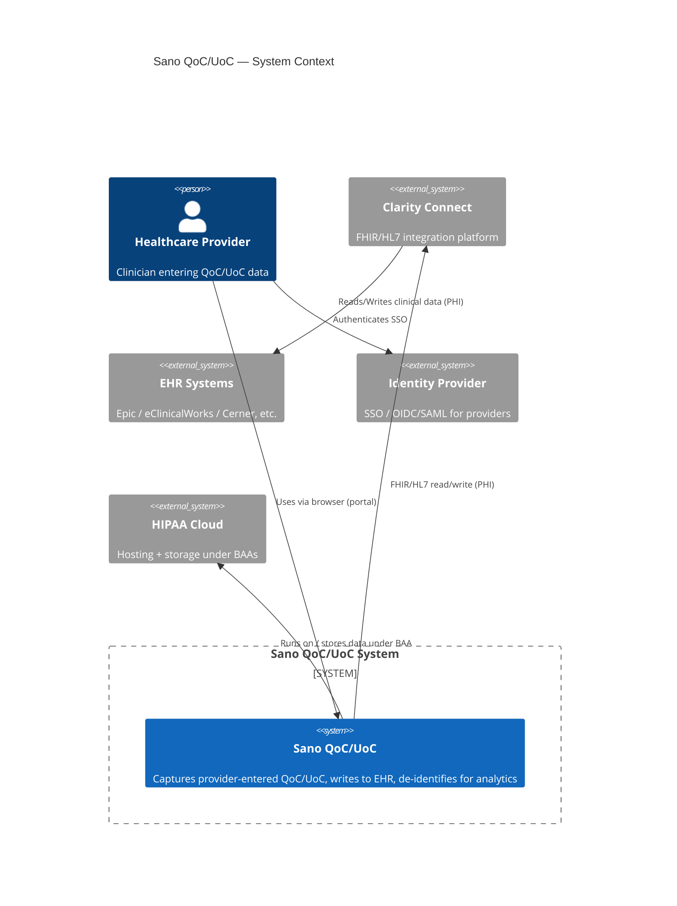

```mermaid
%% C4 System Context
C4Context
title Sano QoC/UoC — System Context

Person(provider, "Healthcare Provider", "Clinician entering QoC/UoC data")
System_Boundary(sano, "Sano QoC/UoC System") {
  System(sano_sys, "Sano QoC/UoC", "Captures provider-entered QoC/UoC, writes to EHR, de-identifies for analytics")
}
System_Ext(clarity, "Clarity Connect", "FHIR/HL7 integration platform")
System_Ext(ehr, "EHR Systems", "Epic / eClinicalWorks / Cerner, etc.")
System_Ext(idp, "Identity Provider", "SSO / OIDC/SAML for providers")
System_Ext(cloud, "HIPAA Cloud", "Hosting + storage under BAAs")

Rel(provider, sano_sys, "Uses via browser (portal)")
Rel(sano_sys, clarity, "FHIR/HL7 read/write (PHI)")
Rel(clarity, ehr, "Reads/Writes clinical data (PHI)")
Rel(provider, idp, "Authenticates SSO")
Rel(sano_sys, cloud, "Runs on / stores data under BAA")
```
